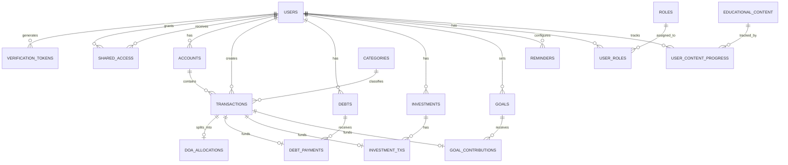

# Diseño Arquitectónico: App de Gestión Financiera Personal

Como arquitecto de software senior, he diseñado esta solución orientada a la escalabilidad, la consistencia de los datos y el alto rendimiento, utilizando principios de diseño relacional normalizado (3FN) para PostgreSQL.

---

## 1. Módulos y Entidades Principales

La aplicación se divide en áreas lógicas de negocio, cada una con entidades clave:

1. **Usuarios (Gestión de Identidad y Acceso)**
   - `User`: Información principal del usuario (email, contraseña, teléfono, país, ciudad, tipo: Natural o Jurídico, estado de verificación).
   - `Shared_Access`: Gestión de acceso compartido entre usuarios de la plataforma.
   - `Verification_Token`: Códigos OTP o tokens para verificar cuentas y recuperar contraseñas vía email o SMS.
   - `Role` / `Permission`: Control de acceso basado en roles (RBAC).
   - `Account`: Cuentas financieras del usuario (Efectivo, Banco, Tarjeta).

2. **Transacciones (Ingresos, Egresos y DOA)**
   - `Transaction`: Entidad central para ingresos y egresos.
   - `Category`: Clasificación de las transacciones (Alimentación, Salario, etc.).
   - `DOA_Allocation`: Asignación específica para el módulo DOA (típicamente *Diezmos, Ofrendas y Ahorros* u otra distribución operativa).

3. **Deudas e Inversiones**
   - `Debt`: Registro de la deuda (monto inicial, tasa de interés, acreedor/deudor).
   - `Debt_Payment`: Pagos realizados a una deuda específica.
   - `Investment`: Portafolio de inversiones (tipo de activo, plataforma, monto inicial).
   - `Investment_Transaction`: Movimientos de la inversión (aportes, retiros, rendimientos).

4. **Metas Financieras**
   - `Goal`: Objetivo financiero (comprar auto, fondo de emergencia), monto objetivo y fecha límite.
   - `Goal_Contribution`: Aportes realizados a una meta específica.

5. **Contenido Educativo**
   - `Content`: Artículos, videos o cursos financieros.
   - `User_Content_Progress`: Seguimiento de lo que el usuario ha consumido.

6. **Recordatorios**
   - `Reminder`: Alertas programadas (pago de servicios, cobro de deudas, vencimiento de metas).

---

## 2. Relaciones entre Entidades

- Un **Usuario** puede otorgar acceso a otros **Usuarios** mediante la entidad **Shared_Access** (Relación N:M recursiva).
- Un **Usuario** genera muchos **Tokens de Verificación** para recuperar claves o validar cuenta (Relación 1:N).
- Un **Usuario** tiene muchas **Cuentas**, **Transacciones**, **Deudas**, **Inversiones**, **Metas** y **Recordatorios** (Relación 1:N).
- Una **Cuenta** tiene muchas **Transacciones** (Relación 1:N).
- Una **Categoría** agrupa muchas **Transacciones** (Relación 1:N).
- Una **Deuda** tiene muchos **Pagos de Deuda** (Relación 1:N).
- Una **Inversión** tiene muchos **Movimientos de Inversión** (Relación 1:N).
- Una **Meta** tiene muchos **Aportes de Meta** (Relación 1:N).
- Un **Usuario** y un **Contenido Educativo** tienen una relación de N:M mediante la tabla **User_Content_Progress**.
- Una **Transacción** puede estar vinculada opcionalmente a un **DOA_Allocation** (Relación 1:1 o 1:N dependiendo de si una transacción se divide).

---

## 3. Modelo de Base de Datos (PostgreSQL)

El siguiente modelo está normalizado para garantizar la integridad referencial y evitar la redundancia.



### Scripts DDL Principales (Ejemplo)

```sql
-- Usuarios y Roles
CREATE TABLE roles (
    id SERIAL PRIMARY KEY,
    name VARCHAR(50) UNIQUE NOT NULL
);

CREATE TABLE users (
    id UUID PRIMARY KEY DEFAULT gen_random_uuid(),
    email VARCHAR(255) UNIQUE NOT NULL,
    is_email_verified BOOLEAN DEFAULT FALSE,
    password_hash VARCHAR(255) NOT NULL,
    first_name VARCHAR(100),
    last_name VARCHAR(100),
    phone VARCHAR(50) UNIQUE,
    is_phone_verified BOOLEAN DEFAULT FALSE,
    country VARCHAR(100),
    city VARCHAR(100),
    user_type VARCHAR(20) NOT NULL DEFAULT 'NATURAL', -- 'NATURAL' o 'JURIDICO'
    created_at TIMESTAMP WITH TIME ZONE DEFAULT CURRENT_TIMESTAMP
);

CREATE TABLE verification_tokens (
    id UUID PRIMARY KEY DEFAULT gen_random_uuid(),
    user_id UUID REFERENCES users(id) ON DELETE CASCADE,
    token VARCHAR(255) NOT NULL,
    type VARCHAR(50) NOT NULL, -- 'EMAIL_VERIFICATION', 'PHONE_VERIFICATION', 'PASSWORD_RECOVERY'
    medium VARCHAR(20) NOT NULL, -- 'EMAIL', 'SMS'
    expires_at TIMESTAMP WITH TIME ZONE NOT NULL,
    is_used BOOLEAN DEFAULT FALSE,
    created_at TIMESTAMP WITH TIME ZONE DEFAULT CURRENT_TIMESTAMP
);

CREATE TABLE user_roles (
    user_id UUID REFERENCES users(id) ON DELETE CASCADE,
    role_id INT REFERENCES roles(id) ON DELETE CASCADE,
    PRIMARY KEY (user_id, role_id)
);

CREATE TABLE shared_access (
    id UUID PRIMARY KEY DEFAULT gen_random_uuid(),
    owner_id UUID REFERENCES users(id) ON DELETE CASCADE,
    guest_id UUID REFERENCES users(id) ON DELETE CASCADE,
    access_level VARCHAR(50) DEFAULT 'READ_ONLY', -- 'READ_ONLY', 'READ_WRITE'
    created_at TIMESTAMP WITH TIME ZONE DEFAULT CURRENT_TIMESTAMP,
    UNIQUE(owner_id, guest_id)
);

-- Cuentas y Categorías
CREATE TABLE accounts (
    id UUID PRIMARY KEY DEFAULT gen_random_uuid(),
    user_id UUID REFERENCES users(id) ON DELETE CASCADE,
    name VARCHAR(100) NOT NULL,
    type VARCHAR(50) NOT NULL, -- e.g., 'BANK', 'CASH', 'CREDIT_CARD'
    balance DECIMAL(15, 2) DEFAULT 0.00,
    currency VARCHAR(3) DEFAULT 'USD'
);

CREATE TABLE categories (
    id SERIAL PRIMARY KEY,
    name VARCHAR(100) NOT NULL,
    type VARCHAR(20) NOT NULL, -- 'INCOME', 'EXPENSE', 'DOA'
    icon_url VARCHAR(255)
);

-- Transacciones (Ingresos y Egresos)
CREATE TABLE transactions (
    id UUID PRIMARY KEY DEFAULT gen_random_uuid(),
    user_id UUID REFERENCES users(id) ON DELETE CASCADE,
    account_id UUID REFERENCES accounts(id) ON DELETE CASCADE,
    category_id INT REFERENCES categories(id),
    amount DECIMAL(15, 2) NOT NULL,
    type VARCHAR(20) NOT NULL, -- 'INCOME', 'EXPENSE', 'TRANSFER'
    description TEXT,
    transaction_date DATE NOT NULL,
    created_at TIMESTAMP WITH TIME ZONE DEFAULT CURRENT_TIMESTAMP
);

-- DOA (Distribución / Diezmos, Ofrendas, Ahorros)
CREATE TABLE doa_allocations (
    id UUID PRIMARY KEY DEFAULT gen_random_uuid(),
    transaction_id UUID REFERENCES transactions(id) ON DELETE CASCADE,
    doa_type VARCHAR(50) NOT NULL, -- 'TITHE', 'OFFERING', 'SAVINGS'
    amount DECIMAL(15, 2) NOT NULL
);

-- Deudas
CREATE TABLE debts (
    id UUID PRIMARY KEY DEFAULT gen_random_uuid(),
    user_id UUID REFERENCES users(id) ON DELETE CASCADE,
    counterparty_name VARCHAR(100) NOT NULL,
    total_amount DECIMAL(15, 2) NOT NULL,
    remaining_amount DECIMAL(15, 2) NOT NULL,
    debt_type VARCHAR(20) NOT NULL, -- 'I_OWE', 'THEY_OWE_ME'
    due_date DATE,
    interest_rate DECIMAL(5, 2) DEFAULT 0.00
);

CREATE TABLE debt_payments (
    id UUID PRIMARY KEY DEFAULT gen_random_uuid(),
    debt_id UUID REFERENCES debts(id) ON DELETE CASCADE,
    transaction_id UUID REFERENCES transactions(id), -- Opcional, si se vincula a una transacción real
    amount DECIMAL(15, 2) NOT NULL,
    payment_date DATE NOT NULL
);

-- Metas
CREATE TABLE goals (
    id UUID PRIMARY KEY DEFAULT gen_random_uuid(),
    user_id UUID REFERENCES users(id) ON DELETE CASCADE,
    name VARCHAR(150) NOT NULL,
    target_amount DECIMAL(15, 2) NOT NULL,
    current_amount DECIMAL(15, 2) DEFAULT 0.00,
    deadline DATE
);

-- Recordatorios
CREATE TABLE reminders (
    id UUID PRIMARY KEY DEFAULT gen_random_uuid(),
    user_id UUID REFERENCES users(id) ON DELETE CASCADE,
    title VARCHAR(150) NOT NULL,
    description TEXT,
    reminder_date TIMESTAMP WITH TIME ZONE NOT NULL,
    is_recurring BOOLEAN DEFAULT FALSE,
    recurrence_rule VARCHAR(100), -- e.g., formato RRULE
    is_active BOOLEAN DEFAULT TRUE
);
```

> [!TIP]
> **Consistencia de Datos:** Las tablas `debt_payments`, `goal_contributions` (no mostrada por brevedad) e `investment_txs` deberían idealmente estar vinculadas a un `transaction_id`. Esto asegura que cada vez que pagas una deuda o aportas a una meta, el dinero sale de una de tus cuentas bancarias registradas, manteniendo el balance exacto.

---

## 4. Casos de Uso Principales

1. **Gestión de Identidad y Seguridad:**
   - *Como usuario*, quiero recibir un código por SMS o email para verificar mi cuenta recién creada.
   - *Como usuario*, quiero recuperar mi contraseña utilizando mi número de teléfono o correo electrónico registrado.

2. **Gestión de Transacciones:**
   - *Como usuario*, quiero registrar un gasto manual asociándolo a una categoría y cuenta para ver a dónde va mi dinero.
   - *Como usuario*, quiero registrar mi salario (Ingreso) y automáticamente asignar un porcentaje al módulo DOA.

2. **Seguimiento de Deudas:**
   - *Como usuario*, quiero registrar un préstamo que le hice a un amigo para que la app me recuerde cobrarle.
   - *Como usuario*, quiero registrar el pago de mi tarjeta de crédito, descontando el saldo de mi cuenta de débito y reduciendo la deuda.

3. **Planificación (Metas e Inversiones):**
   - *Como usuario*, quiero crear una meta de "Fondo de Emergencia" de $5,000 para el próximo año.
   - *Como usuario*, quiero registrar la compra de acciones o criptomonedas y actualizar su rendimiento mensual.

4. **Educación Financiera:**
   - *Como usuario*, quiero leer artículos sobre cómo salir de deudas o invertir, ganando "puntos" o insignias al completarlos.

5. **Notificaciones Automáticas:**
   - *Como sistema*, quiero enviar una notificación push al usuario 2 días antes de que venza la cuota de su préstamo (Recordatorio).

---

## 5. Roles y Permisos

El sistema implementará un Control de Acceso Basado en Roles (RBAC) con los siguientes niveles:

### Roles
1. **`APP_USER` (Usuario Estándar):**
   - Consumidor final de la aplicación móvil.
   - Solo puede acceder a los datos vinculados a su `user_id`.

2. **`PREMIUM_USER` (Usuario Suscrito - Opcional):**
   - Extiende a `APP_USER`.
   - Acceso a reportes avanzados, sincronización bancaria automática, o contenido educativo exclusivo.

3. **`CONTENT_MANAGER` (Administrador de Contenido):**
   - Equipo interno que gestiona la base de conocimientos.
   - Publica, edita y elimina Contenido Educativo. No tiene acceso a datos financieros de usuarios.

4. **`SYSTEM_ADMIN` (Administrador del Sistema):**
   - Gestión de métricas globales, configuración de la aplicación y soporte técnico de nivel 3.

### Matriz de Permisos (Ejemplo)

| Permiso | APP_USER | CONTENT_MANAGER | SYSTEM_ADMIN |
| :--- | :---: | :---: | :---: |
| `finance:read_own` | ✅ | ❌ | ❌ |
| `finance:write_own`| ✅ | ❌ | ❌ |
| `finance:read_all` | ❌ | ❌ | ✅ (Anonimizado) |
| `education:read`   | ✅ | ✅ | ✅ |
| `education:write`  | ❌ | ✅ | ✅ |
| `users:manage`     | ❌ | ❌ | ✅ |

> [!IMPORTANT]  
> **Privacidad y Seguridad:** Los datos financieros son sumamente sensibles. A nivel de base de datos, se debe aplicar Row-Level Security (RLS) en PostgreSQL para garantizar que, incluso si hay una vulnerabilidad en el backend, un usuario jamás pueda consultar las transacciones (`transaction`) o cuentas (`account`) de otro `user_id`.
