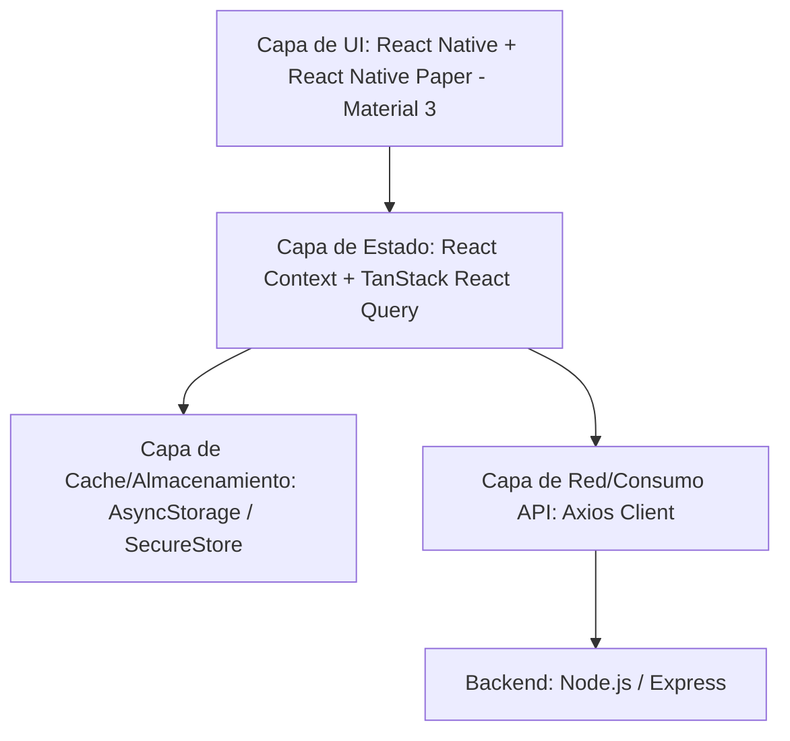

# Plan de Implementación: Aplicación Móvil Bolsi (Android e iOS)

Este plan detalla el diseño de arquitectura y la implementación de la aplicación móvil del proyecto **Bolsi**, utilizando **React Native + Expo** con TypeScript y **Material Design 3**, consumiendo el backend existente y agregando los endpoints faltantes.

---

## Arquitectura de la Aplicación Móvil

Para asegurar un desarrollo limpio, escalable y mantenible en Android e iOS, se propone la siguiente arquitectura organizada en capas lógicas:



### 1. Estructura de Carpetas

Inicializaremos la aplicación móvil en un directorio llamado `bolsi-mobile` con la estructura moderna de **Expo Router (File-based navigation)**:

```text
bolsi-mobile/
├── app/                        # Expo Router Pages/Screens
│   ├── (auth)/                 # Grupo para autenticación
│   │   ├── login.tsx           # Login screen
│   │   ├── register.tsx        # Registro
│   │   ├── recover.tsx         # Recuperación de contraseña (solicitud y reset)
│   │   └── verify.tsx          # Verificación de cuenta (OTP / token)
│   ├── (tabs)/                 # Tab-based principal navigation
│   │   ├── _layout.tsx         # Barra de navegación principal (Custom Material 3)
│   │   ├── home.tsx            # Dashboard general (Balance, KPIs, Gráficos)
│   │   ├── accounts.tsx        # Gestión de Cuentas (CRUD)
│   │   ├── transactions.tsx    # Listado, filtros y creación de Ingresos/Egresos
│   │   ├── debts.tsx           # Gestión de Deudas (Listado, pagos, progreso)
│   │   ├── investments.tsx     # Inversiones (Listado, movimientos, rendimientos)
│   │   ├── goals.tsx           # Metas financieras (Progreso, aportes, estadísticas)
│   │   ├── education.tsx       # Contenido Educativo (Cursos, artículos, videos)
│   │   ├── reminders.tsx       # Recordatorios (Listado, activar/desactivar)
│   │   └── profile.tsx         # Perfil (Editar perfil, seguridad, accesos compartidos, config)
│   ├── _layout.tsx             # Root layout (Proveedores: Auth, QueryClient, PaperTheme)
│   └── index.tsx               # Entry point (redirige inteligentemente al login o al dashboard)
├── src/                        # Código fuente lógica y utilidades
│   ├── components/             # Componentes visuales reutilizables
│   │   ├── ui/                 # Elementos básicos (Button, TextInput, Card, Badge, Spinner)
│   │   ├── charts/             # Gráficos (react-native-chart-kit)
│   │   ├── dashboard/          # Componentes para el dashboard principal
│   │   └── common/             # Layouts de carga (LoadingState, EmptyState, ErrorState)
│   ├── context/                # Contextos globales (AuthContext, OfflineContext)
│   ├── hooks/                  # Hooks personalizados (useAuth, useOffline, usePushNotifications)
│   ├── services/               # Consumo de APIs (Cliente Axios estructurado)
│   │   ├── api.ts              # Configuración base de Axios e interceptores
│   │   ├── auth.service.ts     # Peticiones de Autenticación
│   │   ├── account.service.ts  # Peticiones de Cuentas
│   │   ├── transaction.service.ts # Peticiones de Transacciones e imágenes
│   │   ├── debt.service.ts     # Peticiones de Deudas y Pagos
│   │   ├── investment.service.ts # Peticiones de Inversiones
│   │   ├── goal.service.ts     # Peticiones de Metas
│   │   ├── reminder.service.ts # Peticiones de Recordatorios
│   │   └── content.service.ts  # Peticiones de Contenido Educativo y Progreso
│   ├── types/                  # Interfaces de TypeScript (igual al backend)
│   └── utils/                  # Formateadores (moneda, fechas, validaciones)
├── assets/                     # Recursos de diseño (logos, íconos, imágenes por defecto)
├── app.json                    # Configuración de Expo
├── package.json                # Dependencias
└── tsconfig.json               # Configuración TypeScript
```

---

## Definición de Requerimientos Arquitectónicos

### 2. Navegación
- **Flujo Base:** Controlado dinámicamente mediante el estado de autenticación en `app/_layout.tsx`.
- **Estructura:** Se utilizará un Tab Navigator para las pantallas principales y sub-pantallas del flujo financiero en Stack.
- **Estilo:** Customizado siguiendo las guías de **Material Design 3** con transiciones fluidas de pantalla.

### 3. Manejo de Autenticación
- **Secure Storage:** El token JWT se almacena de forma segura en el dispositivo mediante `expo-secure-store`.
- **Persistencia:** Al iniciar la app, se verifica el token almacenado y se valida contra el perfil del usuario.
- **Sesión Expirada:** Si un endpoint responde `401 Unauthorized`, el interceptor de Axios limpia el almacenamiento seguro y redirige al flujo de login.

### 4. Manejo de Estado
- **Estado Global:** React Context API para temas (Light/Dark mode) y la sesión del usuario (`AuthContext`).
- **Estado del Servidor y Caché:** **TanStack React Query** (`@tanstack/react-query`). Se encargará de:
  - Caching y revalidación en segundo plano.
  - Gestión automática de estados de carga (`isLoading`), vacíos y error.
  - Integración nativa del Pull-to-Refresh y paginación.

### 5. Consumo de APIs
- **Axios:** Instancia centralizada con interceptor de request para inyectar automáticamente el header `Authorization: Bearer <JWT>`.
- **Dynamic Base URL:** Configurado para resolver dinámicamente la IP de la máquina de desarrollo cuando se prueba en dispositivos físicos (usando `expo-constants` para leer la IP del host).

### 6. Manejo de Errores
- **Validación del lado del cliente:** `react-hook-form` con esquemas de validación de `zod`.
- **Interceptores de respuesta:** Capturan respuestas de error globales (400, 401, 403, 500) y las muestran a través de notificaciones toast flotantes no bloqueantes.
- **UI de Feedback:** Pantallas con estado de error dedicadas (`<ErrorState />`) con botón para reintentar la acción.

### 7. Manejo Offline
- **Offline Cache:** Se configurará `AsyncStorage` como adaptador persistente para React Query (`createAsyncStoragePersister`). La aplicación mostrará instantáneamente los datos financieros cargados previamente sin necesidad de Internet.
- **Indicador de Conexión:** Se usa `expo-network` para monitorizar el estado de la red. Si el usuario está offline, se muestra un banner sutil de "Modo de solo lectura offline".
- **Restricción de Escritura:** Se deshabilitará la creación y edición de elementos offline mostrando un aviso al usuario para evitar inconsistencias locales complejas.

### 8. Carga de Imágenes y Comprobantes
- **Carga Eficiente:** Se utilizará la librería optimizada `expo-image` para renderizar imágenes con almacenamiento en caché local.
- **Captura:** `expo-image-picker` para seleccionar de la galería o abrir la cámara para tomar fotos de recibos de transacciones.
- **Upload:** Conversión a FormData y envío al endpoint POST `/api/transactions` (que ya soporta carga con Multer en el backend).

### 9. Notificaciones Push y Alertas
- **Motor Local:** Setup de `expo-notifications` para programar recordatorios financieros locales en el dispositivo (ej. pagos próximos de deudas o alertas de metas).
- **Notificaciones del Sistema:** Registro del token push del dispositivo contra el backend en el login/registro para soportar alertas remotas en el futuro.

---

## Extensiones en el Backend Existente

Dado que la aplicación móvil debe consumir endpoints reales y la lógica de negocio ya implementada en `bolsi-backend`, es indispensable extender el backend para soportar los casos de uso descritos en la aplicación móvil que no estaban expuestos en la API web:

### A. Autenticación y Verificación de Cuenta
Actualmente, `auth.routes.ts` sólo expone `/register` y `/login`. Para soportar el flujo móvil completo:
1. **[NUEVO]** `POST /api/auth/verify-email`: Recibe `{ email, token }`, busca el token en la BD (`VerificationToken`), si es válido marca `is_email_verified = TRUE` en el usuario y cambia el token a usado (`is_used = TRUE`).
2. **[NUEVO]** `POST /api/auth/request-password-recovery`: Recibe `{ email }` o `{ phone }`, crea un token de tipo `PASSWORD_RECOVERY` y devuelve un código de recuperación (OTP).
3. **[NUEVO]** `POST /api/auth/reset-password`: Recibe `{ token, new_password }`, valida el token y actualiza la contraseña del usuario.

### B. Gestión de Cuentas Financieras (CRUD)
El backend tiene la entidad `Account` pero no expone endpoints para gestionarlas:
1. **[NUEVO]** `GET /api/accounts`: Obtiene las cuentas del usuario autenticado.
2. **[NUEVO]** `GET /api/accounts/:id`: Detalle de una cuenta.
3. **[NUEVO]** `POST /api/accounts`: Crea una nueva cuenta (banco, efectivo, tarjeta de crédito) con un balance inicial.
4. **[NUEVO]** `PUT /api/accounts/:id`: Edita el nombre, tipo o moneda de una cuenta.
5. **[NUEVO]** `DELETE /api/accounts/:id`: Elimina la cuenta (y opcionalmente transacciones asociadas en cascada).

### C. Transacciones (Edición y Eliminación)
Actualmente, `transaction.routes.ts` solo soporta `POST /` y `GET /`. Se deben añadir:
1. **[NUEVO]** `GET /api/transactions/:id`: Detalle completo de una transacción (con su categoría y DOA_Allocation).
2. **[NUEVO]** `PUT /api/transactions/:id`: Edita una transacción (monto, tipo, categoría, descripción, comprobante). **Importante:** Se debe ajustar el balance de la cuenta asociada de forma segura reversando el monto anterior y aplicando el nuevo.
3. **[NUEVO]** `DELETE /api/transactions/:id`: Elimina una transacción. **Importante:** Se debe revertir su efecto sobre el balance de la cuenta antes de borrarla.

### D. Deudas, Inversiones y Metas
Se añadirán endpoints para edición y eliminación de estas entidades:
1. **[NUEVO]** `GET /api/debts/:id`, `PUT /api/debts/:id`, `DELETE /api/debts/:id` (Ajustando remaining_amount correspondientemente).
2. **[NUEVO]** `GET /api/investments/:id`, `PUT /api/investments/:id`, `DELETE /api/investments/:id`.
3. **[NUEVO]** `GET /api/goals/:id`, `PUT /api/goals/:id` (Para editar monto objetivo o nombre de meta).

### E. Perfil de Usuario y Accesos Compartidos
1. **[NUEVO]** `GET /api/users/profile`: Obtiene la información del usuario autenticado.
2. **[NUEVO]** `PUT /api/users/profile`: Permite editar datos personales (nombre, apellido, teléfono, país, ciudad).
3. **[NUEVO]** `PUT /api/users/change-password`: Cambia la contraseña (requiere la contraseña actual).
4. **[NUEVO]** `GET /api/users/shared-access`: Lista los accesos compartidos otorgados por el usuario y los recibidos de otros.
5. **[NUEVO]** `POST /api/users/shared-access`: Comparte acceso a sus cuentas financieras con otro usuario buscando por email.
6. **[NUEVO]** `DELETE /api/users/shared-access/:id`: Elimina el acceso compartido.

### F. Exposición de Imágenes Estáticas
1. **[MODIFICACIÓN]** En `app.ts` agregaremos la ruta estática para poder servir las imágenes cargadas en `IMAGES_UPLOAD_PATH`:
   ```typescript
   app.use('/uploads', express.static(process.env.IMAGES_UPLOAD_PATH || '/data/images'));
   ```

---

## Plan de Trabajo y Ejecución

Proponemos dividir el desarrollo en las siguientes fases lógicas:

### Fase 1: Implementación de Extensiones del Backend
Implementar en el backend existente todos los endpoints CRUD y de negocio requeridos por la app móvil que no están disponibles actualmente (Cuentas, Verificación OTP, Recuperación de clave, Edición/Eliminación de deudas, metas, transacciones y perfil).

### Fase 2: Configuración del Proyecto Móvil (`bolsi-mobile`)
1. Crear el proyecto React Native con Expo y configurar TypeScript.
2. Instalar dependencias esenciales (`react-native-paper`, `@tanstack/react-query`, `axios`, `expo-router`, `expo-secure-store`, `expo-image`, `expo-image-picker`, `expo-notifications`, `react-hook-form`, `zod`).
3. Definir la paleta de colores y el tema de Material Design 3 (Light/Dark mode) consistente.

### Fase 3: Capa de Datos, Autenticación y Offline
1. Configurar la base de Axios, interceptores de seguridad y lógica de IP dinámica.
2. Implementar el `AuthContext` con soporte de `SecureStore` (Login, Registro, Recuperación, Verificación y Logout).
3. Configurar React Query con persistencia en `AsyncStorage` para soporte offline.

### Fase 4: Implementación de Pantallas y Funcionalidades
1. **Dashboard & Cuentas:** Dashboard principal con balances generales, gráficos interactivos de ingresos/egresos y CRUD de cuentas bancarias.
2. **Transacciones:** Formularios de creación y edición de ingresos/egresos (con distribución DOA en ingresos y subida de fotos de comprobantes en egresos), listado paginado con filtros avanzados.
3. **Deudas, Inversiones y Metas:** Listado y registro de deudas con pagos, portafolio de inversiones con sus movimientos e historial, y metas con aportes e indicador de porcentaje y progreso visual.
4. **Recordatorios y Contenido Educativo:** Recordatorios configurables con notificaciones locales y la biblioteca CMS con progreso de cursos/artículos del usuario.
5. **Perfil, Seguridad y Configuración:** Pantallas de edición de perfil, cambio de clave, compartir acceso financiero, y cambio de configuraciones locales de idioma, moneda y notificaciones.

### Fase 5: Pruebas y Pulido Visual
1. Pruebas de navegación, rendimiento, respuesta offline y carga de imágenes.
2. Ajustar transiciones, micro-animaciones en botones y cards, estados de carga y error en todas las pantallas.

---

## Plan de Verificación

### Pruebas Automatizadas
- Ejecutaremos pruebas de integración de los nuevos endpoints del backend.
- Validaremos los esquemas de petición en el backend con Zod.

### Verificación Manual
- Validaremos el flujo de registro y el envío/uso del token de verificación OTP.
- Probaremos la aplicación en emuladores de Android (usando Expo Go) para certificar el rendimiento, la adaptabilidad de las vistas a pantallas de varios tamaños y el funcionamiento offline.
- Validaremos el flujo de subida de comprobantes de pago tomando fotos desde el emulador/dispositivo móvil.

---

## Preguntas Abiertas para el Usuario

> [!IMPORTANT]
> **Por favor revisa estas dudas de diseño y arquitectura:**
> 
> 1. **Tecnología del Proyecto Móvil:** Proponemos usar **Expo** con TypeScript y **React Native Paper** (para Material Design 3). ¿Estás de acuerdo con este stack tecnológico?
> 2. **Configuración de IP de Backend:** Para probar en un emulador o en un dispositivo real con Expo Go, la app móvil necesitará consumir el backend usando la IP local de tu máquina en lugar de `localhost`. Configuraremos una detección automática. ¿Esto es adecuado para tu entorno de red?
> 3. **Implementación de Endpoints Faltantes en el Backend:** ¿Deseas que agregue los endpoints listados en la sección "Extensiones en el Backend Existente" directamente en el proyecto `bolsi-backend` actual para que la app móvil pueda consumirlos correctamente?
